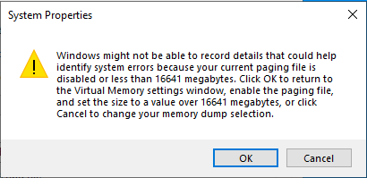
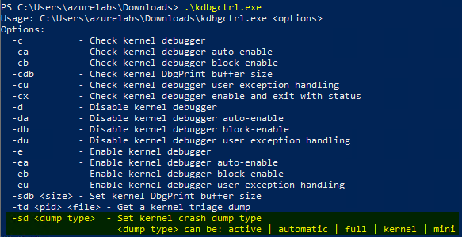
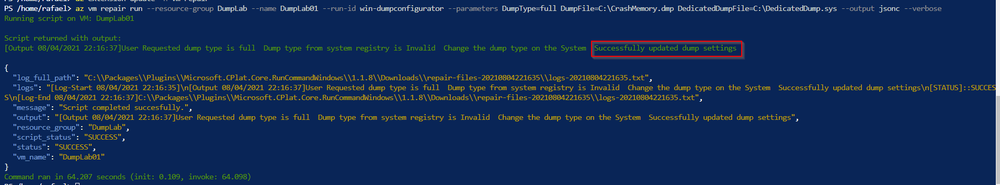
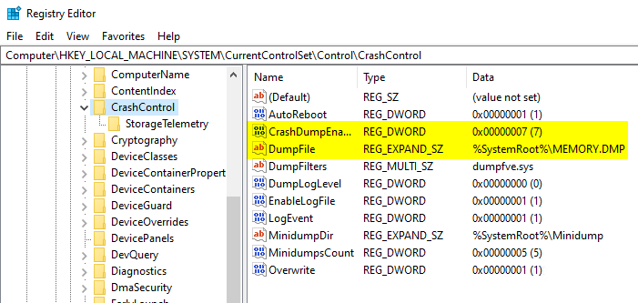
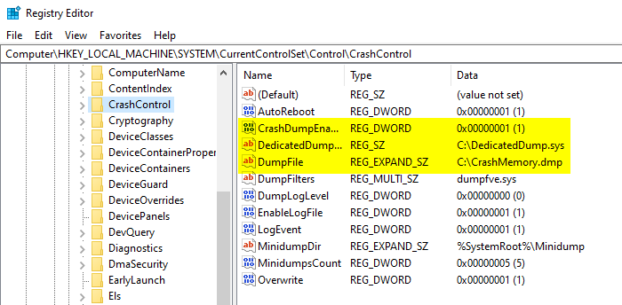
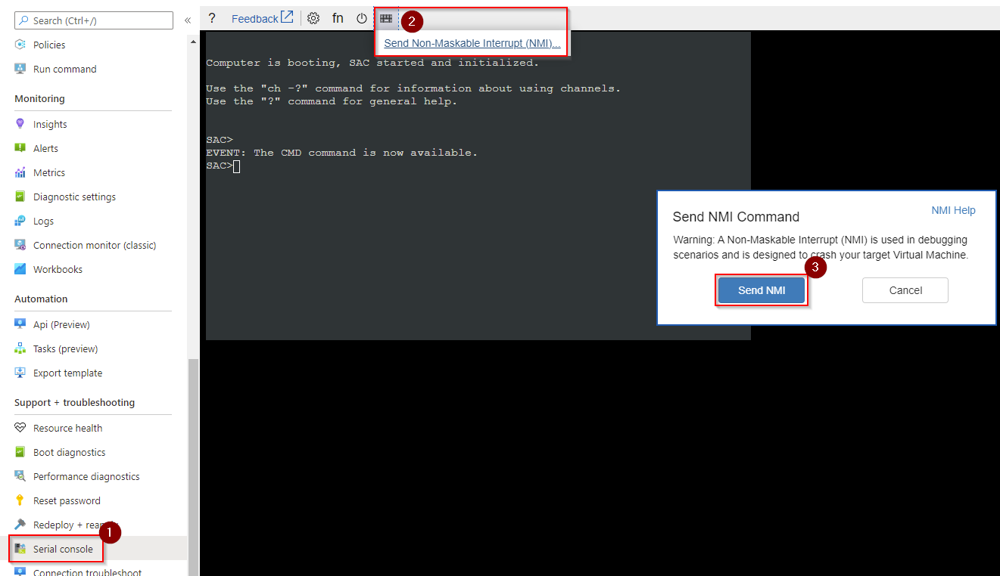
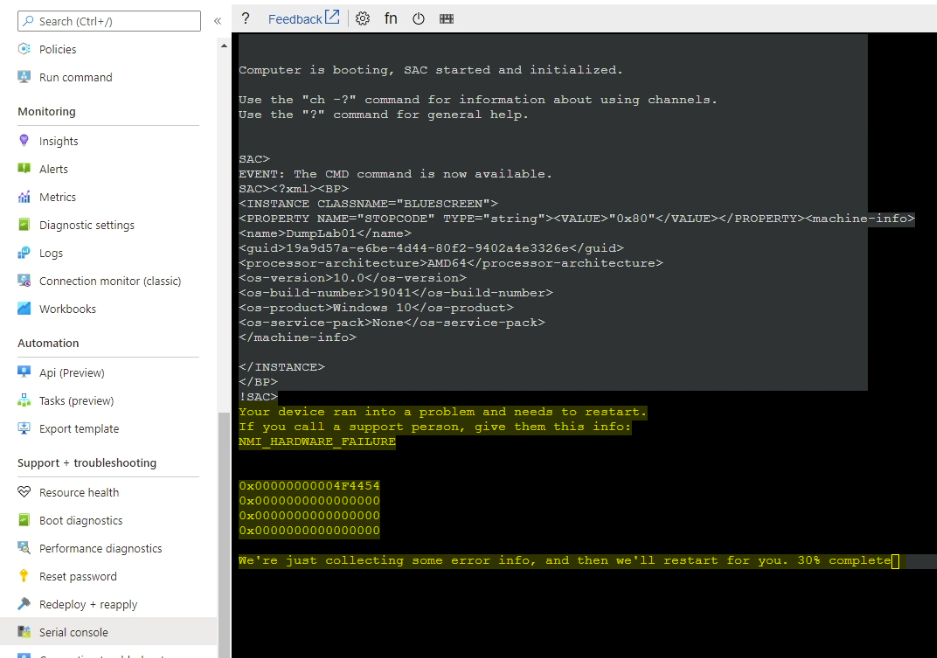
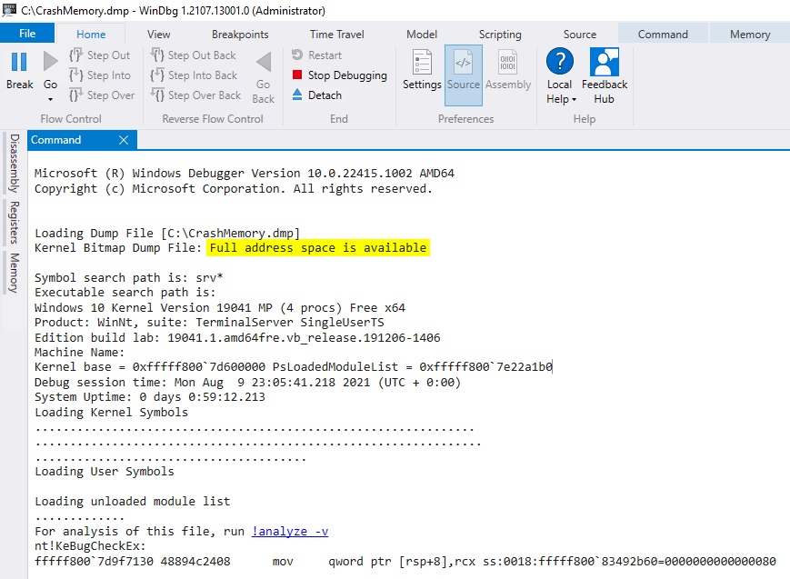

# How to change Windows memory dump file option in Azure VMs without a restart

## Problem

Currently [Azure Windows marketplace images](https://azuremarketplace.microsoft.com/en-us/marketplace/apps/category/compute?page=1&filters=windows%3Bmicrosoft%3Bvirtual-machine-images) are set with "[Automatic memory dump](https://docs.microsoft.com/en-us/windows-hardware/drivers/debugger/automatic-memory-dump)" file option.  


System > Advanced system settings > Startup and Recovery > Settings…


This configuration will allow a "Kernel memory dump" to be generated in case of an unexpected Stop error (also known as blue screen of death) happen.


Sometimes when you are troubleshooting complex scenarios, you need a "Complete memory dump" (also known as Full memory dump). Changing that, while the problem is happening, may be a problem as most of the times you would need to change paging file settings, sometimes change dump location and even restart the machine to validate the changes. This could take the system out of the behavior you are investigating and cause a lot of extra work changing everything back later on.



## Workaround

One solution to work around this is using [Kernel Debugging Control](https://docs.microsoft.com/en-us/windows-hardware/drivers/debugger/using-kdbgctrl) tool to perform changes.

One of the cool functions of this tool is that it allows you to set the system to capture "Complete memory dump" without the need of a restart/reboot.

> .\kdbgctrl.exe -sd full



For Windows Azure VMs there is a repair script that downloads the tool and helps you to set the desired configuration.

[Az vm repair | Microsoft Docs](https://docs.microsoft.com/en-us/cli/azure/vm/repair?view=azure-cli-latest)

> az vm repair list-scripts

```powershell
PS C:\> az vm repair list-scripts --query 'map[].{Id:id}' --output table
Id
------------------------------
win-hello-world
linux-hello-world
win-error-test
linux-error-test
win-chkdsk-fs-corruption
win-sfc-sf-corruption
win-bcdedit-ignoreAllFailure
linux-alar-fki
win-enable-nested-hyperv
win-toggle-safe-mode
win-dumpconfigurator
win-collect-attached-disk-logs
```

Check the [Repair Script Library GitHub page](https://github.com/Azure/repair-script-library) if you want to know more about it.

## Changing the settings

We are going to use the [win-dumpconfigurator](https://github.com/Azure/repair-script-library/blob/master/src/windows/win-dumpconfigurator.ps1) to change our dump settings.

> win-dumpconfigurator

The repair command invokes [Azure VM RunCommand extension](https://docs.microsoft.com/en-us/azure/virtual-machines/windows/run-command) using the 'win-dumpconfigurator' scripts to set your VM with the following:
- The dump type you desire - in our case here a 'full' dump
- The destination where you want to save the dump - in case you have a machine with a lot of memory, you may need a big disk 
- And a dedicated dump file to replace the need of changing the machine's paging file

Here is the [AZ CLI](https://docs.microsoft.com/en-us/cli/azure/install-azure-cli) command:

> az vm repair run --resource-group `<RGName`> --name `<VMName`> --run-id win-dumpconfigurator --parameters DumpType=full DumpFile=C:\Memory.dmp DedicatedDumpFile=C:\DedicatedDump.sys --output jsonc --verbose



Here you see the Crash Control registry configuration before and after the change:
> HKLM\SYSTEM\CurrentControlSet\Control\CrashControl

| Before      | After       |
| ----------- | ----------- |
| | |

Notice that the repair script also changes the DumpFile destination and adds DedicatedDumpFile entry to set a dedicated dump file to replace the use of paging file for the dump capture.


Now let's generate a crash on the Windows Azure VM using [NMI](https://docs.microsoft.com/en-us/troubleshoot/azure/virtual-machines/serial-console-windows#use-the-serial-console-for-nmi-calls)



We can see the 'NMI_HARDWARE_FAILURE' and the system collecting error info.



To confirm that this is really a full memory dump, we can use [WinDBG Preview](https://docs.microsoft.com/en-us/windows-hardware/drivers/debugger/debugger-download-tools) to open the new dump file and check it.



# Extra

There are some big VM sizes on Azure with a lot of memory. In case you are investigating a problem in one of these huge memory VMs, and you need a full memory dump, you may run out of space on your current dump file location.

A workaround here is to attach one or more data disks on the VM and set the DumpFile and DedicatedDumpFile to direct their files to these new disks. I would expect the dump, when generated, to use the same amount of space as the VM's memory, same for the dedicated dump file.

# Important

The bigger the VM's memory size, the longer it will take to generate the dump file! Remember this when planning the dump capture, as this will impact the time to the VM to get back online.

## Final consideration
 
I hope this information can help you investigate your problem further.

In case you need help with your issue, please consider contacting [Azure support](https://ms.portal.azure.com/#blade/Microsoft_Azure_Support/HelpAndSupportBlade/overview).
