# Preventing Brute Force Attacks in Azure VMs

## Overview

Hacker attacks in Cloud environments are more common than you can image. One of the reasons for this is that the public IPs used by most cloud providers are listed on the internet. You can download the list of Azure's IPs [here](https://www.microsoft.com/en-us/download/details.aspx?id=41653). Hackers are using this information to search for vulnerabilities to exploit.

The [Brute-force attack](https://en.wikipedia.org/wiki/Brute-force_attack) is where a malicious individual tries to find out a valid username and password to get access to your environment. Put simply, the attack consists in subsequent attempts to logon using a list of common usernames and password. If the credentials are easy to guess, the attacker will be able to access your environment.

## Detecting Brute-force attacks
 
Brute-force attacks in VMs are not difficult to detect as the failed attempts to logon are registered on the security logs.
 
In the Windows OS, you can check the attempts on the 'Security' event logs.

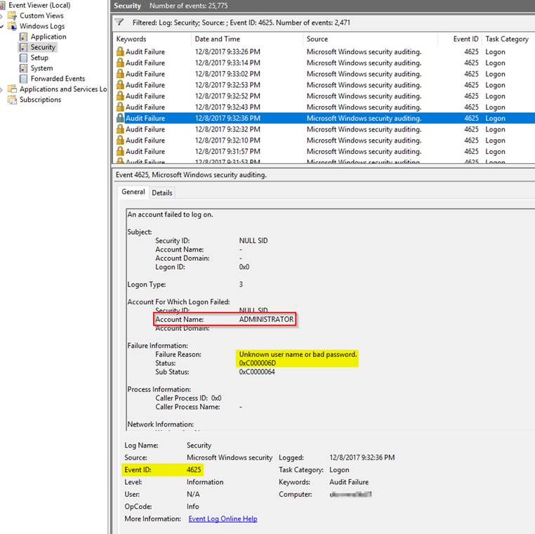

The following PowerShell script may help to see a list of the attempts:

```powershell
$filter = @"
    (Event/System/EventID=4625)
        and
    Event/EventData[
        (Data[@Name='LogonType'] = 10 or Data[@Name='LogonType'] = 3)
        and (Data[@Name='Status'] = '0xc000006d')
    ]
"@
 
$events = Get-WinEvent -LogName Security -FilterXPath $filter
foreach ($e in $events)
{
    '{0} - An account failed to log on - SourceIP: {3} - username: {1}\{2}' -f $e.TimeCreated.ToUniversalTime().ToString('u'), $e.Properties[6].value, $e.Properties[5].value, $e.Properties[19].value
}
```
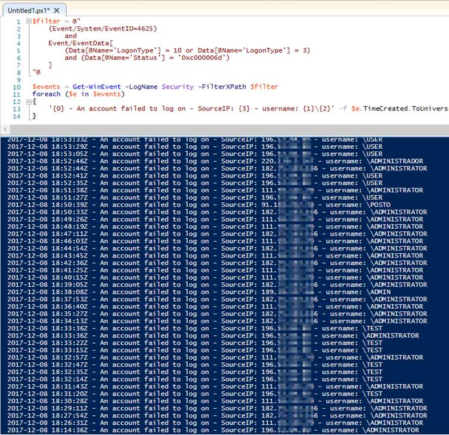

Or using this other command to check 'Microsoft-Windows-RemoteDesktopServices-RdpCoreTS/Operational' event logs:

```powershell
$filter = '(Event/System/EventID=140)'
 
$events = Get-WinEvent -LogName 'Microsoft-Windows-RemoteDesktopServices-RdpCoreTS/Operational' -FilterXPath $filter
foreach ($e in $events)
{
    '{0} - {1}' -f $e.TimeCreated.ToUniversalTime().ToString('u'), $e.Message
}
```
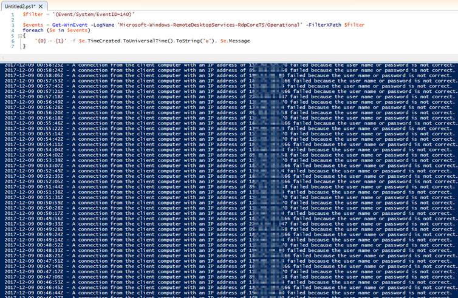

In Ubuntu you can search for 'Failed password for' in the /var/log/auth.log

```
$ grep ']: Failed password for' /var/log/auth.log
```
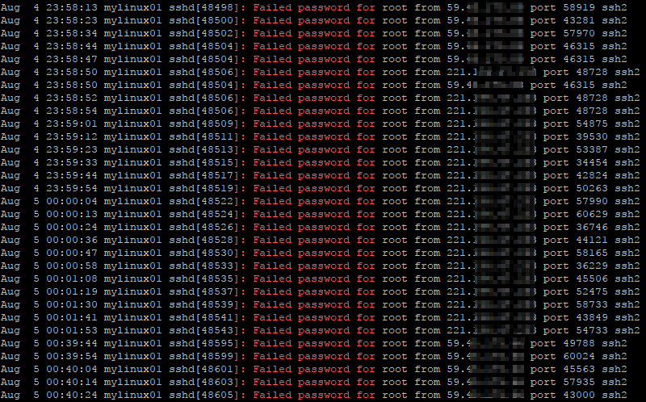

If you check one of your Azure VMs you will probably see a few failed attempts to connect as well.

You may be saying to yourself: I am an experienced IT engineer and I am following all the password policy best practices. It will be really hard for a hacker to figure out my credentials. Why should I care about this?

Here comes the trick: Malicious individuals could be trying to attempt a [Distributed Denial-of-Service attack](https://en.wikipedia.org/wiki/Denial-of-service_attack) (DDoS) using Brute-force from many different sources, the principle motive being to cause you harm. In every attempt to logon your VM needs to accept the client connection, try to authenticate the invalid user and report it back. The malicious individuals can even reduce the response speed of the client, causing your VM to have to wait longer during this attempt to authenticate. It can definitely compromise the availability and performance of the VM.

Again, the hackers main goal might be to slow down your system instead of breaking your security password. Discovering a valid credential may be an extra bonus. 

## Preventing Brute-force attacks
 
Ok, now that we have stated the problem and showed how to detect it, we need to talk about how to prevent it. There are many options available and I want to show you a few.
 
### Preventing Brute-force attacks - at OS level

Let's start talking about options that individuals new to Cloud environments normally take into consideration first: blocking or filtering requests at OS level.

If you are comfortable with the Linux or Windows firewall, why not filtering  access to only your IPs, setting a rule direct at the OS level? Or even install an application, such as [RdpGuard](https://rdpguard.com/), that detects the attack and blocks temporarily the IP where it is coming from? Well, there are many things to consider, but first of all I would like to say that this solution is totally valid. 

However this approach needs more work during the implementation and maintenance phases, since all the configurations and updates are made directly at the guest OS level. If your ISP changes your IP, you will need to change the firewall rule in all the VMs. There are some options to address this, but if you can control this at Azure level thus reducing the work, why not?

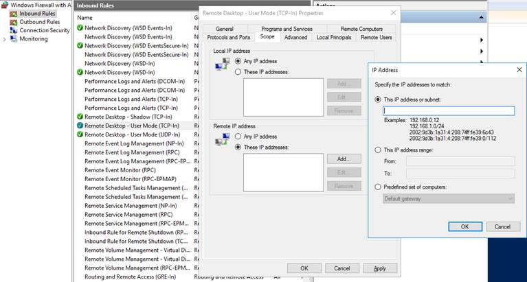

### Preventing Brute-force attacks - using a VPN

The option that needs more planning and time for implementation is the one that I consider more secure. I would avoid setting an public IP to the VMs and would only access them through a [VPN](https://docs.microsoft.com/en-us/azure/vpn-gateway/vpn-gateway-howto-site-to-site-resource-manager-portal?toc=%2fazure%2fvirtual-network%2ftoc.json) (site-to-site or point-to-site) or a [ExpressRoute](https://docs.microsoft.com/en-us/azure/expressroute/expressroute-howto-linkvnet-portal-resource-manager?toc=%2fazure%2fvirtual-network%2ftoc.json). Of course you could add a public IP to the VM that needs to be facing the internet, but I would still block RDP/SSH ports and only access these VM's ports using its internal IP through the VPN. In this solution all the traffic between your on-premises environment and Azure would flow in a secure VPN tunnel. 

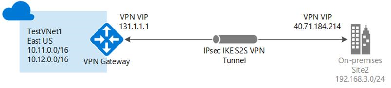

The problem of choosing this option is the level of network knowledge you need to have to implement it. If you decide you want to dig deeper into this, I would recommend you read the [Azure Virtual Network documentation](https://docs.microsoft.com/en-us/azure/virtual-network/virtual-network-vnet-plan-design-arm) to be able to understand how it works and how to implement the VPN in a proper way.
 
### Preventing Brute-force attacks - using NSG

The easiest and fastest option available is to use a [Network Security Group](https://docs.microsoft.com/en-us/azure/virtual-network/virtual-networks-nsg) (NSG) rule to [filter network traffic](https://docs.microsoft.com/en-us/azure/virtual-network/virtual-networks-nsg) into your VMs. When creating a new VM and a new NSG with it, default rules are created, but these rules do not restrict source IP, allowing any IP to try to connect into your VM.

The approach consists in adding your IP or a range of IPs that are allowed to access the VM in the 'Source IP' of the NSG rule responsible for filtering the specific traffic. 

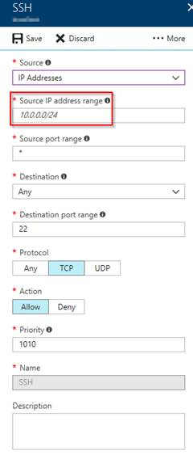

We can consider a NSG as a kind of firewall that you can manage at Azure level and it can be associated with network cards or with VNet subnets. NSGs contain two sets of rules: Inbound and outbound. The priority for a rule must be unique within each set.

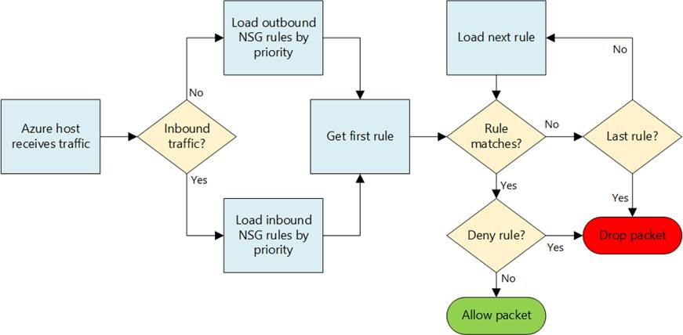

The problem with this option is similar to setting a rule on the firewall at guest OS level, if your ISP changes your IP, your access to the VMs will be blocked until you update the rule with your new IP.

Another thing is If your ISP gives your old IP to another user, this new user won't be filtered by the NSG rule until you change it. Not that the new user will know that he/she can try to access your VM, but this can't be guaranteed.
 
### Preventing Brute-force attacks - using a Public Load Balancer with NAT rules

Another option is using a [Public Load Balancer](https://docs.microsoft.com/en-us/azure/load-balancer/load-balancer-overview) in front of your VM with a NAT rule to redirect the traffic of a random port you chose to the VM's RDP/SSH port.

Using a random port makes hackers' life a little bit more difficult.  First, they need to find out the port you are using for RDP/SSH before starting an Brute-force attack, which is not difficult as there are many [port scanner](https://en.wikipedia.org/wiki/Port_scanner) software available on the internet, but sometimes they would rather spend their time attacking the other VMs that are using the RDP/SSH default ports.

In this option you give a public IP to the Load Balancer and can remove the public IP from the VM.

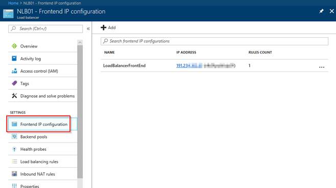

You need to add the VM and its IP in a backend pool to allow the Load Balancer to know where you want the traffic to be redirected.

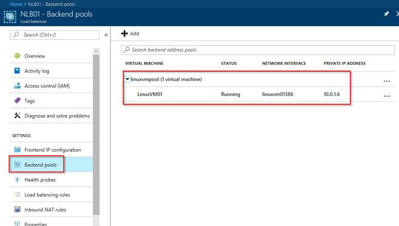

Then you need to add the Inbound NAT rule.

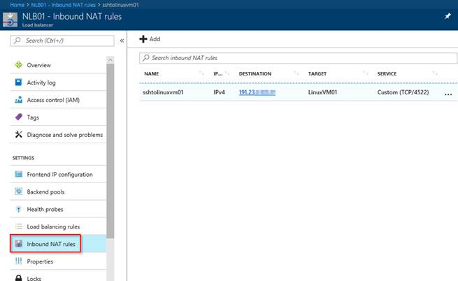

In this example, I chose Load Balancer's port 4522 to redirect to port 22 into the VM. It means that all the incoming traffic to port 4522 on the load Balancer IP will be redirected to port 22 on the internal IP of the VM. 

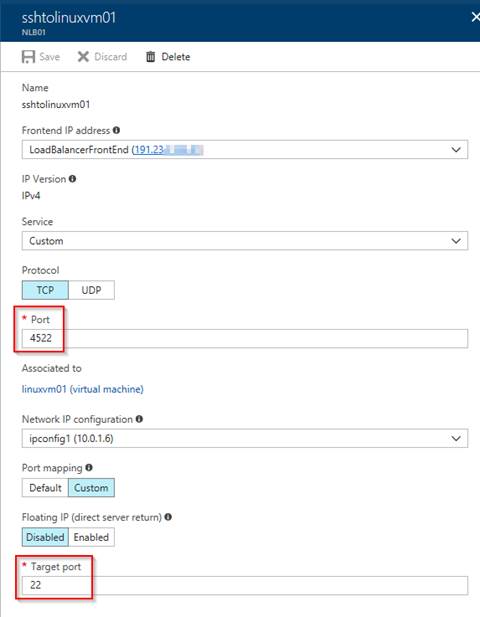

One important thing to remember when using a Load Balancer is that the NSG can be only used in a network card or in a subnet and a Load Balancer does not have any of these. What I mean here is that you still need to add a rule on the NSG that is filtering the network traffic of the VM allowing RDP/SSH connections. Preferably a rule that is only going to allow traffic from your IP, since hackers can find out the port you are using in the NAT rule and start the Brute-force attack.

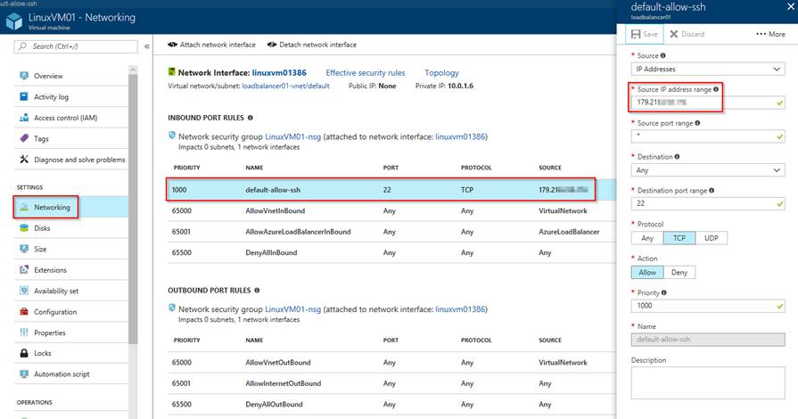

### Preventing Brute-force attacks - using Just in time VM access

The last option that I believe is worth considering is the new [Azure Support Center](https://docs.microsoft.com/en-us/azure/security-center/security-center-intro) feature - [Just in time VM access](https://aka.ms/asc-jit). This feature is still in preview at the time I am writing this. As with [most previews](https://azure.microsoft.com/en-us/support/legal/preview-supplemental-terms/), this should not be used for production workloads until the feature reaches General Availability (GA). However you can check it out and test it to see if it will help.

This option consists in using the [Standard tier](https://docs.microsoft.com/en-us/azure/security-center/security-center-pricing) of Azure Support Center to enhance security detection and management. In this tier the Just in time VM access option will be available for your VMs and you can use it to give temporary access to a specific IP or a range of IPs for a restricted amount of time. This way the access is blocked all the time and to access the VM you need to request it. As soon as the rule expires, the access is blocked again.

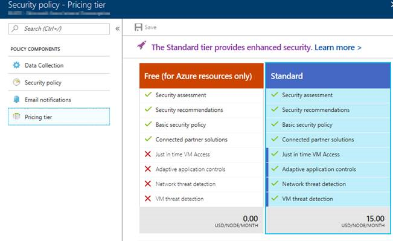

The Standard tier is free for the first 60 days. For more information, see the Security Center [pricing page](https://azure.microsoft.com/en-us/pricing/details/security-center/).
 
After enabling the Standard tier you can access the 'Just in time VM access' blade, select one of the recommended VMs and enable JIT on it, adding the specific rules you want.

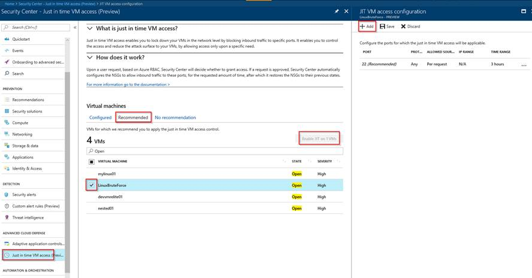

This will add a new rule on the VM's NSG denying access into that port.

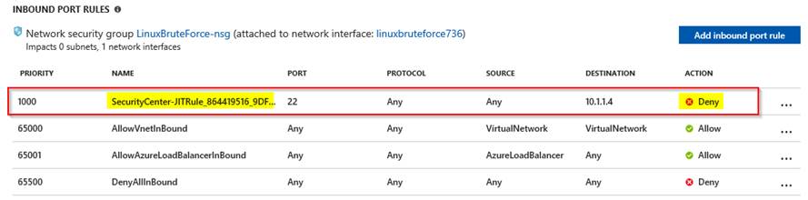

Upon a user request, based on Azure RBAC, Security Center will decide whether to grant access. If a request is approved, Security Center automatically configures the NSG to allow inbound traffic to these ports for the requested amount of time, after which it restores the NSGs to their previous states.

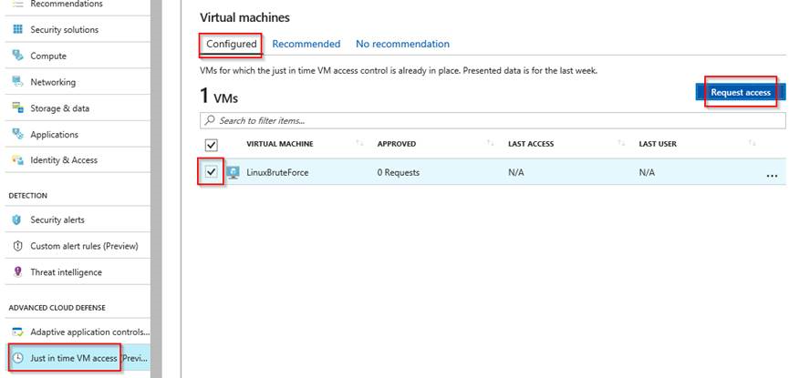

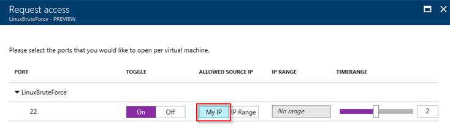

In this example I requested access to my IP (the one my ISP provided) for 2 hours.

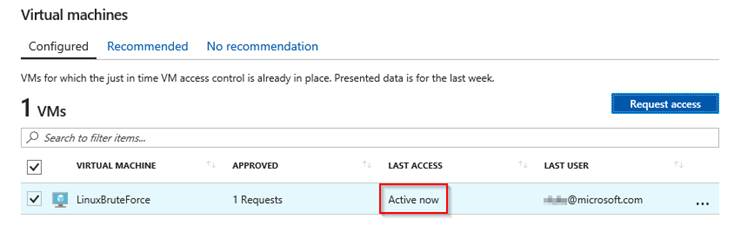

Security Center added another rule in the VM's NSG allowing access into that port from my IP.

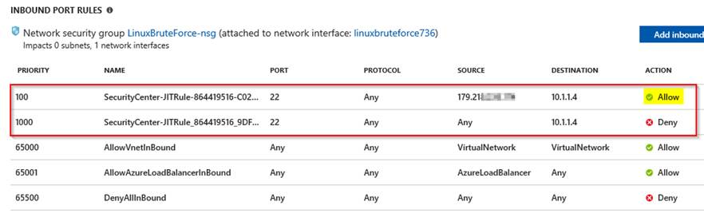

For the next 2 hours I had access to the VM.

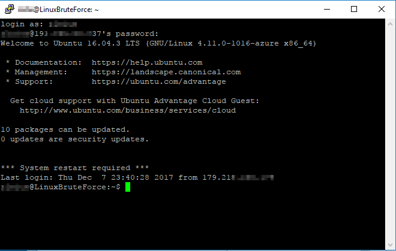

One more interesting thing here is that you can track who requested access to the VM and when on the [Audit Logs](https://docs.microsoft.com/en-us/azure/security-center/security-center-just-in-time#auditing-just-in-time-access-activity).
 
## Final consideration
 
I hope this information can help you in preparing a more secure environment and thus reduce the number of attacks you may otherwise suffer. Please, regardless of the way you do it, the most important thing is that you should block any undesired access.
 
If you still have any more questions or need more details on how to proceed, please [contact Azure support](https://portal.azure.com/?r=1#blade/Microsoft_Azure_Support/HelpAndSupportBlade) and we will be glad to help you.